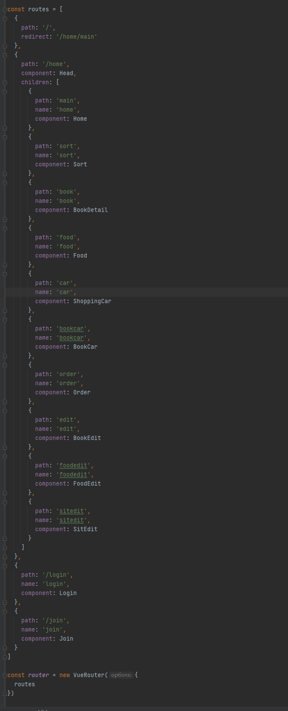
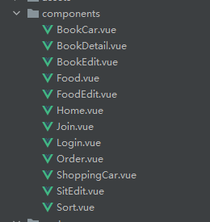
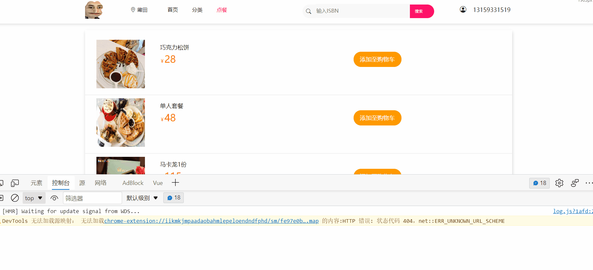
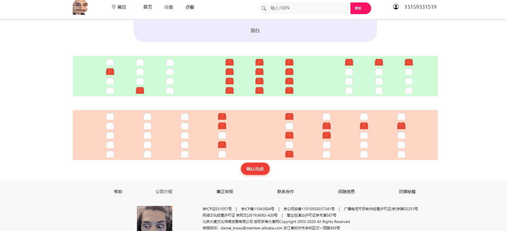
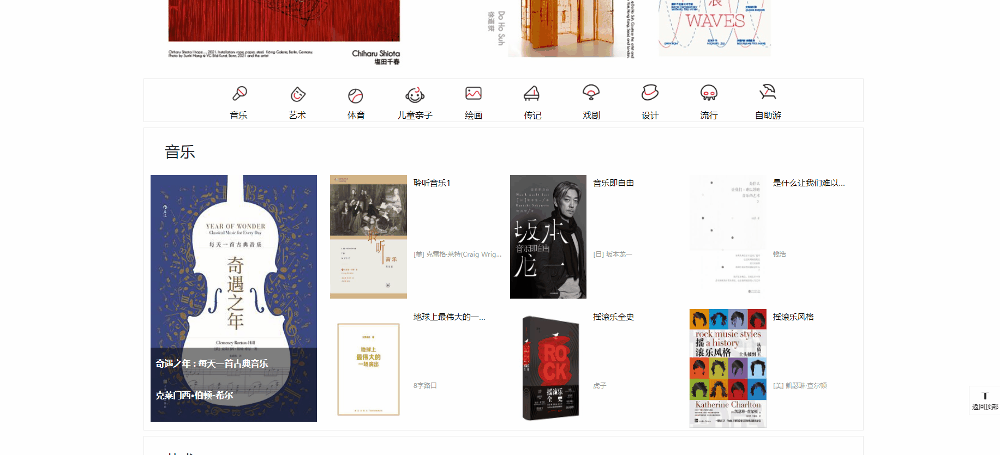
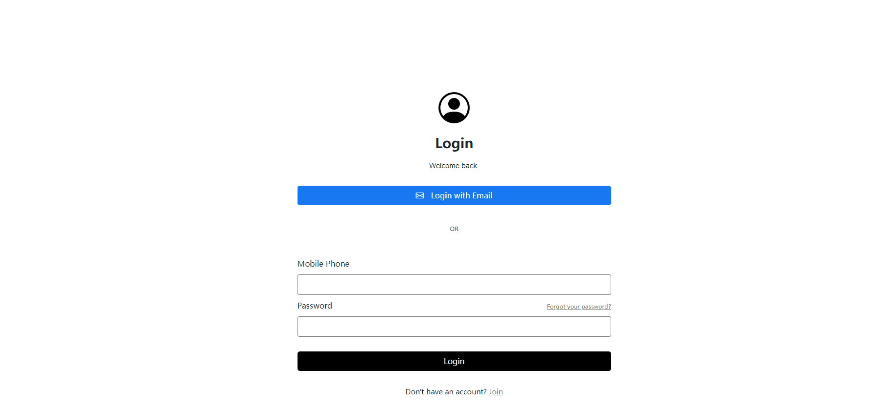

# 基于springmvc+mybatis 的网红书屋自助服务平台的设计与实现

课设项目，前后端开发一个商户系统，通过ssm生成需要的接口，前端使用axios传输数据，开发周期两周

## 技术栈

#### 前端部分：

* vue+vue-router(核心)
* axios(请求处理)
* vuex(全局数据传输)
* bootstrap(响应式开发)

### 后端：

* ssm框架（spinrg+springmvc+mybatis）
[项目后端部分快捷跳转](https://github.com/bigtitsboy/book_Spingmvc-vue-mybatis)

## 功能分析与设计

vuejs部分

在本书屋自助服务系统中，游客可以注册成为用户、查看图书信息、在线购买餐饮并可查看且预定座位。管理员可以查看修改图书的信息及其分类、餐饮信息及其分类和座位修改等。以上功能不但为书屋管理者带来便捷的管理，还为其客户带来更好的用户体验。让顾客订位置、点餐饮、借图书可自主完成，方便快捷。
***
* 购物车数据采用vuex为了解决刷新数据丢失情况结合localstorage持久化存储，只有当用户提交订单后才写入数据库，减少对服务器的请求量；
* 注册采用正则表达式匹配手机号，区分管理员账户和普通用户
* 登录信息存储到cookies中，访问页面时可以验证是否登录
* 管理员账户可以修改一切信息，包括取消已预定的位置或者占用未预定位置；管理员功能只在验证完cookies后显示，普通用户无法查看
* 退出账户将清空vuex和localstorage以及cookies
***
路由结构如下

***
组件部分

***

附上界面效果图
* 主页部分
  
  
* 图书部分
  

* 购物车部分
  

* 用户选座
  
  
* 管理员页面
  

* 登录注册
  

* 响应式
  
